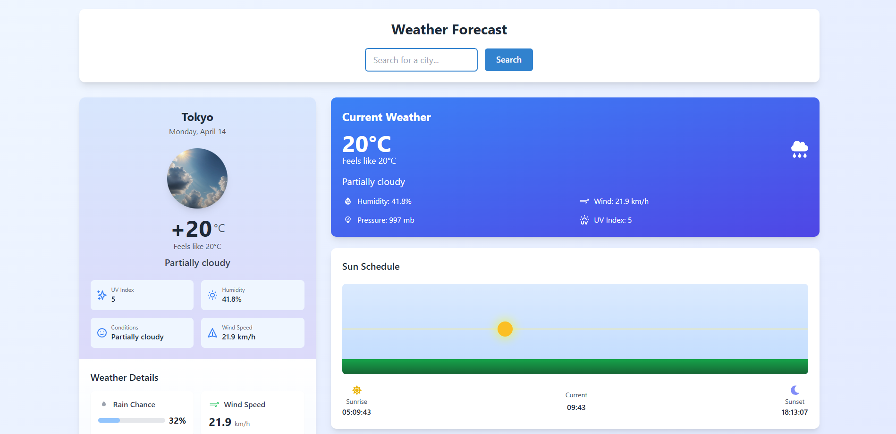
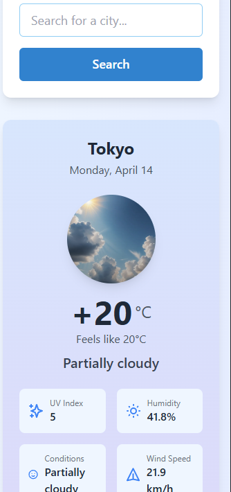

 # 🌦️ Weather App


این اپلیکیشن با استفاده از Next.js توسعه یافته و به کاربران امکان می‌دهد شهر موردنظر خود را وارد کرده و اطلاعات آب‌وهوایی مربوط به آن را مشاهده کنند. از جمله ویژگی‌های این اپلیکیشن می‌توان به نمایش نمودار پیش‌بینی ۱۵ روزه و مشاهده جزئیات آب‌وهوای ۹ روز آینده به‌صورت مجزا اشاره کرد.

## 🛠️ تکنولوژی‌ها  
- **Next.js 14+** (استفاده از server action برای مدیریت درخواست‌های سمت سرور)  
- **Recharts** برای نمایش نمودار پیش‌بینی ۱۵ روزه  
- **Chakra UI** برای بهینه‌سازی سرعت توسعه  
- **Tailwind CSS** برای طراحی سبک و سریع  
- **Visual Crossing API** برای دریافت داده‌های آب‌وهوای شهرها  

## 🚀 ویژگی‌ها  
✅ نمایش دمای فعلی، رطوبت و سرعت باد  
✅ جستجوی شهرها با API  
✅ نمایش چارت ۱۵ روزه  
✅ رابط کاربری سریع و بهینه  
✅ طراحی کاملاً ریسپانسیو  
<table align="center">
  <tr>
    <td align="center">
      <br/>
      <strong>Desktop View</strong>
    </td>
    <td align="center">
      <br/>
      <strong>Mobile View</strong>
    </td>
  </tr>
</table>
## 🔧 نحوه اجرا  

```bash
git clone https://github.com/mrejo11/weather-webApp.git  
cd weather-app  
npm install  
npm run dev
```
## 🔗 نسخه دمو  
برای مشاهده پیش‌نمایش پروژه، به [این لینک](https://weather-re.netlify.app) مراجعه کنید.

# 🌦️ Weather App

This application is developed using Next.js and allows users to enter their desired city and view the corresponding weather data. Some of the key features include displaying a 15-day forecast chart and viewing detailed weather information for the next 9 days separately.

## 🛠️ Technologies  
- **Next.js 14+** (using server actions for managing server-side requests)  
- **Recharts** for displaying the 15-day forecast chart  
- **Chakra UI** for optimizing development speed  
- **Tailwind CSS** for lightweight and fast design  
- **Visual Crossing API** for fetching weather data  

## 🚀 Features  


✅ Displays current temperature, humidity, and wind speed  
✅ City search functionality with API  
✅ 15-day forecast chart  
✅ Fast and optimized user interface  
✅ Fully responsive design  

## 🔧 How to run  

```bash
git clone https://github.com/mrejo11/weather-webApp.git  
cd weather-app  
npm install  
npm run dev
```

## 🔗 Demo Version  
To view the live preview of the project, visit [this link](https://weather-re.netlify.app).

